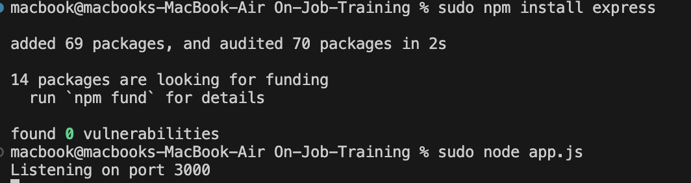
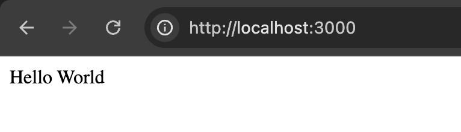
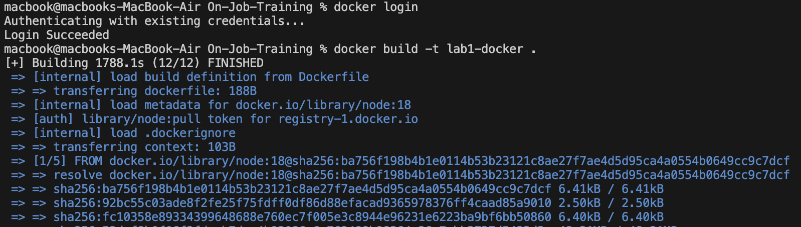
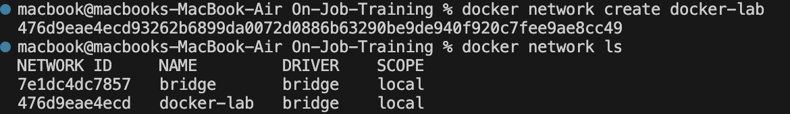
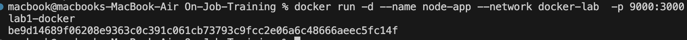
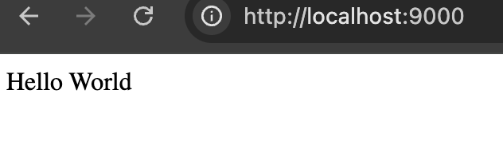
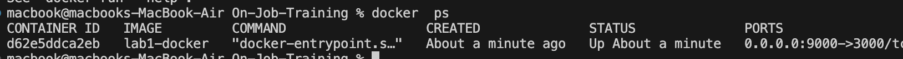
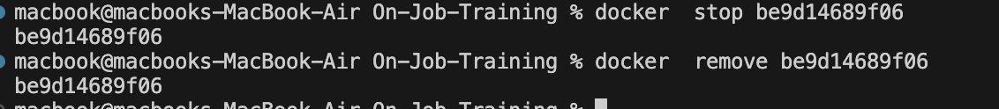

# 📘 Dockerized Node.js App Documentation

## 🏗 Overview
This project is a simple Node.js application that uses Express to serve a "Hello, Dockerized Node.js App!" message. The application is containerized using Docker, making it easy to deploy and scale.

## 🔧 Prerequisites
Before getting started, ensure you have the following installed on your system:

- **Node.js** 
- **Docker** 

## 📂 Project Structure
```
my-node-app/
├── app.js               # Main application file
├── Dockerfile           # Docker configuration file
├── package.json         # Node.js dependencies and scripts
└── README.md            # Project documentation (this file)
```

## 🚀 Setup Instructions

 
### 1️⃣ Install Dependencies
Install the required Node.js dependencies:

```bash
npm install
```


### 2️⃣ Run the App Locally
To run the app without Docker:

Visit **http://localhost:3000** 



## 🐳 Docker Setup

### 1️⃣ Build the Docker Image
Build the Docker image for the Node.js app:

```bash
FROM node:18
WORKDIR /usr/src/app
COPY package*.json ./
RUN npm install
COPY . .
EXPOSE 3000
CMD ["node","app.js"]
```


### 2️⃣ Create a New Bridge Network
To ensure network isolation and facilitate communication between containers, create a new Docker bridge network:



### 3️⃣ Run the Docker Container Inside the Network
Run the container within the newly created bridge network:



Visit **http://localhost:9000** to access the app.



### 4️⃣ Stop the Container
To stop the running container, first find its container ID using:



Then, stop the container with remove:




