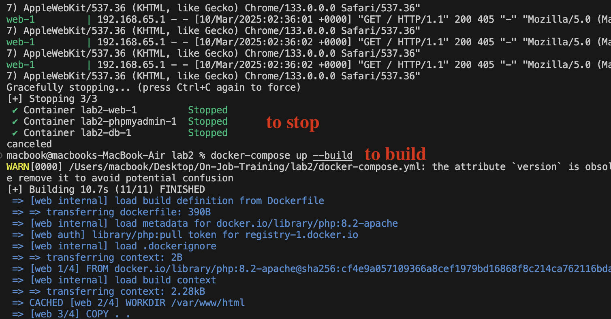

# **PHP MySQL Docker App**  

This project demonstrates how to build a **PHP web application** with a **MySQL database** and **phpMyAdmin**, all containerized using **Docker** and orchestrated with **Docker Compose**.  

## **Technologies Used**  
- **PHP 8.2** – Backend scripting language for the web app.  
- **Apache** – Web server to serve the PHP application.  
- **MySQL 8.0** – Relational database to store application data.  
- **phpMyAdmin** – Web-based interface to manage MySQL databases.  
- **Docker** – Containerization platform to package the application.  
- **Docker Compose** – Tool for defining and running multi-container Docker applications.  

---

## **Project Structure**  

```
my-php-app/
├── Dockerfile           # Dockerfile for the PHP app
├── index.php           # PHP script for the web app
├── docker-compose.yml  # Docker Compose configuration
└── README.md           # Project documentation
```

---

## **How It Works**  

1. The **PHP web app** runs inside an Apache container.  
2. The **MySQL database** is deployed in a separate container with persistent storage.  
3. The user list is fetched and displayed dynamically on the page. 
4. **Docker Compose** orchestrates all three services.  

---

## **Steps to Build and Run the App**  

### **1. Create the Dockerfile**  

The `Dockerfile` defines the environment for the PHP web app:  

```Dockerfile
# Use an official PHP + Apache image as base
FROM php:8.2-apache

# Set the working directory in the container
WORKDIR /var/www/html

# Copy the application files to the container
COPY . .

# Install MySQL extensions for PHP
RUN docker-php-ext-install mysqli pdo pdo_mysql

# Expose port 80 to allow access
EXPOSE 80
```

---

### **2. Create the Docker Compose File (`docker-compose.yml`)**  

The `docker-compose.yml` file defines three services:  

- `web`: Runs the PHP app on Apache and serves the website on port 8080.
- `db`: Runs MySQL, storing user data persistently using the mysql_data volume.
- `phpmyadmin`: Web-based MySQL management tool.  

```yaml
version: '3.8'

services:
  web:
    build: .
    container_name: php_app
    ports:
      - "8080:80"
    volumes:
      - .:/var/www/html
    depends_on:
      - db

  db:
    image: mysql:8.0
    container_name: mysql_db
    environment:
      MYSQL_ROOT_PASSWORD: rootpassword
      MYSQL_DATABASE: mydatabase
      MYSQL_USER: myuser
      MYSQL_PASSWORD: mypassword
    volumes:
      - mysql_data:/var/lib/mysql
    restart: always

  phpmyadmin:
    image: phpmyadmin/phpmyadmin
    container_name: phpmyadmin
    environment:
      PMA_HOST: db
      PMA_USER: myuser
      PMA_PASSWORD: mypassword
    ports:
      - "8081:80"
    depends_on:
      - db

volumes:
  mysql_data:
```

---

## **4. Running the Application**  

### **Start the Containers**  
Run the following command in the project directory:  

```sh
docker-compose up --build -d
```

### **Access the Application**  

- **PHP Web App**: Open **`http://localhost:8080`** in browser.  
- **phpMyAdmin**: Open **`http://localhost:8081`** and log in with:  
  - **Username**: `myuser`  
  - **Password**: `mypassword`  

---

## **5. Understanding `docker-compose.yml`**  

### **Key Components:**  

- **`version: '3.8'`** – Specifies the Docker Compose file version.  
- **`services:`** – Defines multiple containers (PHP, MySQL, phpMyAdmin).  
- **`depends_on:`** – Ensures that MySQL starts before the PHP app and phpMyAdmin.  
- **`volumes:`** – Uses a named volume (`mysql_data`) to persist MySQL data.  
- **`restart: always`** – Ensures that MySQL restarts automatically if it stops.  

---

## **6. Persistent Storage**  

The MySQL database uses a **Docker volume** (`mysql_data`) to **store data permanently**. Even if the MySQL container is stopped or removed, the data remains available.  

```yaml
volumes:
  mysql_data:
```

---

## **7. Application Overview**  

### **1️⃣ User Interface (index.php)**  
✅ **A form allows users to enter their name and email,Submitted data is stored in MySQL**  
✅ **A table dynamically displays all users from the database.**  

### **2️⃣ Database Management (phpMyAdmin)**  
✅ **Access phpMyAdmin at http://localhost:8081.**  
✅ **Manage the mydatabase and view the users table.**  

---

## **Screenshots**
**✅ User Management System in Action**


**✅ phpMyAdmin Interface**


**✅ varifying**


