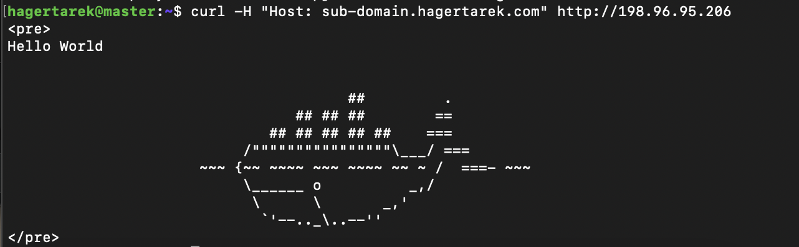

# Kubernetes Hello-World Deployment

This guide walks through deploying a simple "hello-world" application using Kubernetes. The application utilizes the `crccheck/hello-world` Docker image and is exposed via an NGINX Ingress Controller.

---

## 🚀 Deployment Steps

### 1️⃣ Create the Deployment

The following steps will create a Kubernetes deployment using the `crccheck/hello-world` Docker image.

#### 📝 Create the Deployment YAML

Create a file named **`hello-world-deployment.yaml`** and add the following content:

```yaml
apiVersion: apps/v1
kind: Deployment
metadata:
  name: hello-world-deployment
  labels:
    app: hello-world
spec:
  replicas: 3
  selector:
    matchLabels:
      app: hello-world
  template:
    metadata:
      labels:
        app: hello-world
    spec:
      containers:
      - name: hello-world
        image: crccheck/hello-world
        imagePullPolicy: IfNotPresent
        ports:
        - containerPort: 8000
        livenessProbe:
          httpGet:
            path: /
            port: 8000
          initialDelaySeconds: 10
          periodSeconds: 15
```

#### ▶️ Apply the Deployment

```bash
kubectl apply -f hello-world-deployment.yaml
```

#### 🔍 Verify the Deployment

```bash
kubectl get deployment hello-world-deployment
```

---

### 2️⃣ Create the Service

Now, create a Kubernetes service to expose the deployment.

#### 📝 Create the Service YAML

Create a file named **`hello-world-service.yaml`** and add the following content:

```yaml
apiVersion: v1
kind: Service
metadata:
  name: hello-world-service
  labels:
    app: hello-world
spec:
  selector:
    app: hello-world
  ports:
  - port: 80
    targetPort: 8000
  type: ClusterIP
```

#### ▶️ Apply the Service

```bash
kubectl apply -f hello-world-service.yaml
```

#### 🔍 Verify the Service

```bash
kubectl get service hello-world-service
```

---

### 3️⃣ Create the Ingress

An ingress will route external traffic to the service using a domain.

#### 📝 Create the Ingress YAML

Create a file named **`hello-world-ingress.yaml`** and add the following content. Replace `hagertarek`:

```yaml
apiVersion: networking.k8s.io/v1
kind: Ingress
metadata:
  name: hello-world-ingress
  annotations:
    nginx.ingress.kubernetes.io/rewrite-target: /
    nginx.ingress.kubernetes.io/ssl-redirect: "true"
spec:
  ingressClassName: nginx
  defaultBackend:
    service:
      name: hello-world-service
      port:
        number: 80
  rules:
  - host: sub-domain.hagertarek.com
    http:
      paths:
      - path: /
        pathType: Prefix
        backend:
          service:
            name: hello-world-service
            port:
              number: 80
```

#### ▶️ Apply the Ingress

```bash
kubectl apply -f hello-world-ingress.yaml
```

#### 🔍 Verify the Ingress

```bash
kubectl get ingress hello-world-ingress
```
---

## 🌐 Accessing the Application

access the application via:

```
curl -H "Host: sub-domain.hagertarek.com" http://198.96.95.206
```


---

### 🎯 Summary

✅ Created a Kubernetes deployment for the `hello-world` application.  
✅ Exposed the application via a Kubernetes Service.  
✅ Configured an Ingress for external access using a domain.  
✅ Verified the deployment and cleaned up resources when needed.

Enjoy your Kubernetes journey! 🚀

